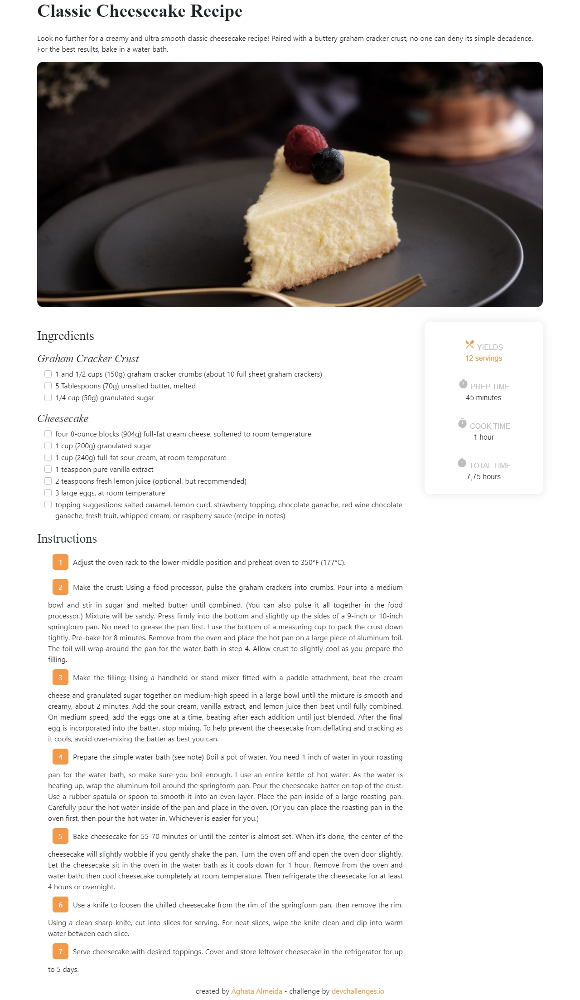
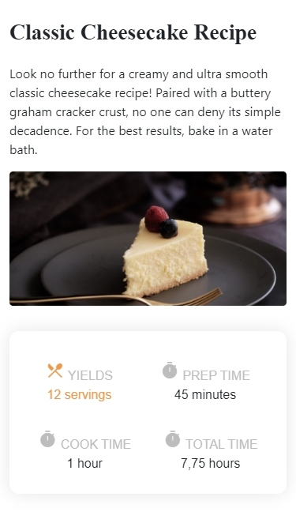

<!-- Please update value in the {}  -->

<h1 align="center">Blog de receitas</h1>

   Página desenvolvida para um desafio de  <a href="http://devchallenges.io" target="_blank">Devchallenges.io</a>.

  <h3>
    <a href="https://recipe-blog-eapa.vercel.app/">
      Preview
    </a>
     | 
    <a href="https://devchallenges.io/challenges/OEKdUZ6xs0h99C38XVht">
      Desafio
    </a>
  </h3>

<!-- TABLE OF CONTENTS -->

## Índice

- [Visão Geral](#visão-geral)
  - [Ferramentas](#ferramentas)
  - [Features](#features)
- [Contato](#contato)
- [Agradecimentos](#gradecimentos)

<!-- OVERVIEW -->

## Visão geral

### Ferramentas

<!-- This section should list any major frameworks that you built your project using. Here are a few examples.-->

- HTML 5
- CSS 3
- [Bootstrap 5](https://getbootstrap.com/)
- [SASS](https://sass-lang.com/)
- [Material Icons](https://developers.google.com/fonts/docs/material_icons)

## Features

<!-- List the features of your application or follow the template. Don't share the figma file here :) -->

Essa página foi criada a partir de um desafio do site [DevChallenges](https://devchallenges.io/challenges). O [desafio](https://devchallenges.io/challenges/TtUjDt19eIHxNQ4n5jps) foi criar uma página de blog que cumprisse as seguintes histórias de usuário:

- [x] User story: Posso ver uma receita com ingredientes e modo de preparo.
- [x] User story: Posso marcar uma caixa de seleção caso eu tenha um ingrediente.
- [x] User story: Posso ver o número de porções e o tempo de preparo.

## Agradecimentos

<!-- This section should list any articles or add-ons/plugins that helps you to complete the project. This is optional but it will help you in the future. For exmpale -->

- [Passo a passo para estilizar uma lista numerada](https://blog.logrocket.com/styling-numbered-lists-with-css-counters/)
- [Lista de classes do Bootstrap 5](https://bootstrapcreative.com/resources/bootstrap-5-cheat-sheet-classes-index/)

## Contact

- GitHub [@a-almeida10](https://github.com/a-almeida10)
- Linkedin [Ághata Almeida](https://www.linkedin.com/in/aghata-almeida/)
